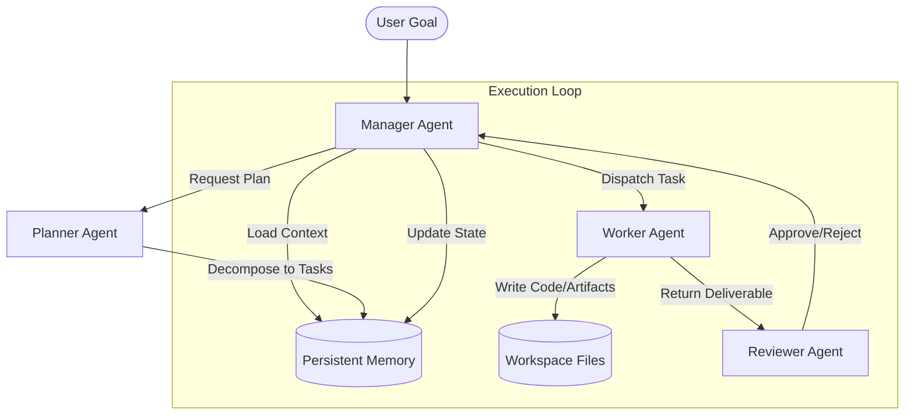

# Aythron Genesis

Aythron Genesis is a production-grade, multi-agent AI orchestration platform that enables multiple local and cloud-based AI models to collaborate through shared memory, dynamic planning, intelligent task routing, and validation.

Designed for long-running execution and seamless collaboration between human developers and AI assistants, the system uses persistent, file-based memory as its absolute source of truth.

---

## Architecture Overview



### Core Components
1. **Manager Agent (`agents/manager.py`)**: The central engine. Coordinates planning, schedules tasks based on dependency completion, handles file extraction, and updates persistent memory logs.
2. **Planner Agent (`planner/planner.py`)**: Breaks down a high-level goal into logical, dependent task structures inside a JSON schema.
3. **Worker Agent (`workers/worker.py`)**: Specialized reasoning agent that generates scripts, conducts analysis, and outputs files.
4. **Reviewer Agent (`reviewer/reviewer.py`)**: Acts as a quality checker, analyzing deliverables against the task requirements and providing structured feedback or approvals.
5. **Memory System (`memory/`)**: File-based persistent store that preserves state across restarts and handoffs.

---

## Features

- **Multi-Agent Orchestration**: Sequential task execution with automated worker-reviewer validation loops.
- **Local Model Focus**: Built-in support for Ollama (Llama, DeepSeek, Qwen) with customizable client connection configurations.
- **Dynamic File Writeback**: Worker agents generate code blocks (e.g. `[FILE: filename.ext]`) which the manager extracts and writes to the workspace.
- **Visual Dashboard**: Glassmorphic dark-themed SPA displaying active agents, log outputs, task boards, and an interactive memory inspector/editor.
- **Sandbox Testing Mock Mode**: Instantly test features out-of-the-box using the integrated sandbox mock provider without needing Ollama installed.

---

## Memory System

The memory system is stored in the `memory/` directory and acts as the source of truth for the project state.

- `memory/project_state.json`: High-level status, version info, completed features, known issues, and architecture decisions.
- `memory/tasks.json`: Active task list, completion statuses, assignees, and dependencies.
- `memory/roadmap.md`: Chronological milestone list and development progress.
- `memory/decisions.md`: Chronological log of architectural decision records (ADRs).
- `memory/session_log.md`: Detailed logs of runs and agent interactions.
- `memory/context.md`: General workspace guidelines and system context.

---

## Installation

### Prerequisites
- Python 3.12+
- (Optional) [Ollama](https://ollama.com/) running locally for executing actual LLM completions.

### Local Setup
1. **Clone the repository**:
   ```bash
   git clone https://github.com/yourusername/aythron-genesis.git
   cd aythron-genesis
   ```

2. **Run the startup script**:
   The startup script will automatically build a virtual environment, install requirements, and boot up the FastAPI app:
   ```bash
   ./scripts/run.sh
   ```

3. **Access the Web Interface**:
   Open [http://localhost:8000](http://localhost:8000) in your browser.

---

## Docker Quick Start

For containerized execution:
1. **Build and start container**:
   ```bash
   docker-compose up --build
   ```
2. **Access Web Interface**:
   Open [http://localhost:8000](http://localhost:8000).
   *Note: Inside docker, the platform connects to your host-running Ollama at `http://host.docker.internal:11434`.*

---

## Configuration

Settings can be customized using a local `.env` file or environment variables:

| Variable | Default | Description |
|---|---|---|
| `OLLAMA_HOST` | `http://localhost:11434` | Endpoint url for the local Ollama instance |
| `DEFAULT_MODEL` | `qwen2.5:7b` | Default active Ollama model |
| `PLANNER_MODEL` | `qwen2.5:7b` | Ollama model dedicated to the Planner Agent |
| `WORKER_MODEL` | `qwen2.5:7b` | Ollama model dedicated to the Worker Agent |
| `REVIEWER_MODEL` | `qwen2.5:7b` | Ollama model dedicated to the Reviewer Agent |
| `PORT` | `8000` | Port for the FastAPI server |

---

## Contribution & AI Developer Workflow

Any AI assistant or developer picking up this codebase must:
1. **Load System Context**: Read files under `memory/` to understand the state.
2. **Write Memory Files**: On completing task objectives, update `memory/project_state.json`, `memory/tasks.json`, and write a log entry in `memory/session_log.md`.
3. **Log Design Decisions**: Add new decisions under `memory/decisions.md` as standard ADR formats.

---

## Roadmap

- [x] Initial scaffold and API + UI dashboard
- [x] Mock and Ollama provider support
- [x] Shared filesystem-based memory updates
- [ ] Task branching & conditional workflows
- [ ] Parallel task execution
- [ ] Support for tools (Terminal command runner, web retriever)

---

## License

This project is open-source and licensed under the [MIT License](LICENSE).
